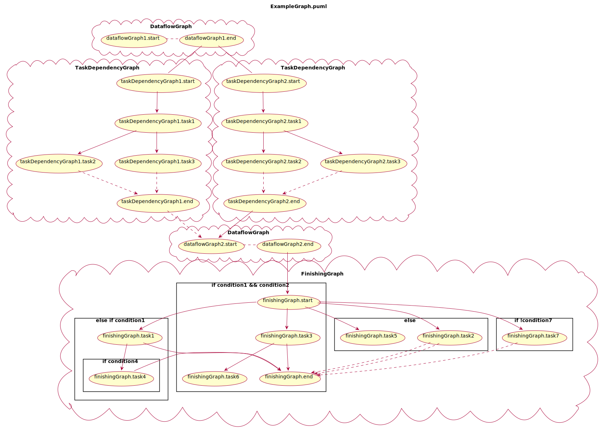

# C2Puml

Simple prototype for translating graphs built in C to PlantUML for visualization.
This is not generally applicable and assumes a few ground rules for formatting, naming, and overall implementation for the C source file.

Generated graphic for `c_code/ExampleGraph.c`:


## How to run
Modify config file `c2puml_config.json` with the wanted paths. Then run
```bash
python3 c2puml.py
```

## Techniques and tools applied

- Docker, docker-compose, Dev Containers for development environment
- Makefile for task automation
- Black & isort for formatting
- Pylint for code analysis
- Pytest for unit testing
- Tree structure and recursion for parsing
- Inheritance & abstract classes to enhance code reusability
- Factory pattern for subclass creation
- Builder pattern for creating a mock file
- State machine to extract relevant code parts
- Regex to create correct mappings
- Python's pattern matching, string manipulation, list comprehension
